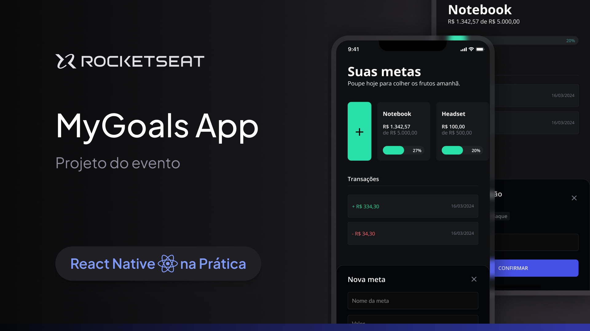

<h1 align="center">
  
</h1>

### Links

🔴 **Assista meus vídeos no YouTube:** [@orodrigogo](https://www.youtube.com/@orodrigogo)

🔴 **Figma do projeto:** [MyGoals App](https://www.figma.com/community/file/1346604660147063430)

---

<h1 align="center">
  
</h1>

### Sobre o projeto

Imagine que Rodrigo deseja comprar um Notebook novo que custa R$ 5.000,00. Ele acha prudente poupar o dinheiro necessário para comprar à vista, conseguir um bom preço e não comprometer o orçamento com parcelas.
Por isso, pode usar esse App Minhas Metas para poupar até atingir sua meta financeira para adquirir um Notebook novo. Esse é um dos projetos desenvolvidos em aula do evento React Native na Prática.

### Dica para usar esse repositório
Na branch `main` você irá encontrar somente as interfaces do App. Na branch `finished` você irá encontrar o código completo do App pronto com as funcionalidades implementadas.
